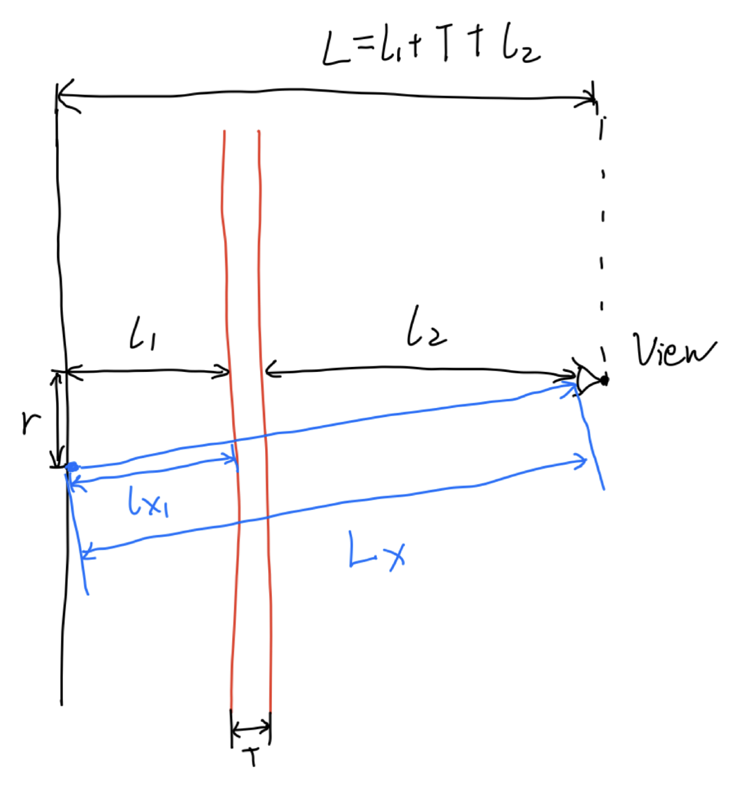

# Simulation of Moire Pattern Effect in Volume Rendering
This is a project for simulation the moire pattern effect in direct volume rendering.

## Environment requirement
* Visual Studio 2019
* OpenCV

## Principle
* This model simulate the situation that only one slice volume is in a "virtual volume cube". In back-to-front ray casting algorithm, every ray starts in the back surface of the "virtual volume cube", and sample the volume along the ray with a constant step size. As the slice volume is slim, some rays can get the value but others miss it. And the assumption of mine is the above reason will cause a periodic round strip, as moire pattern effect. Illustration figure is as follows:
* 
